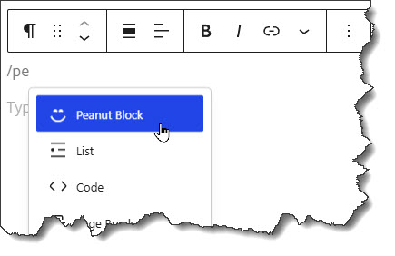
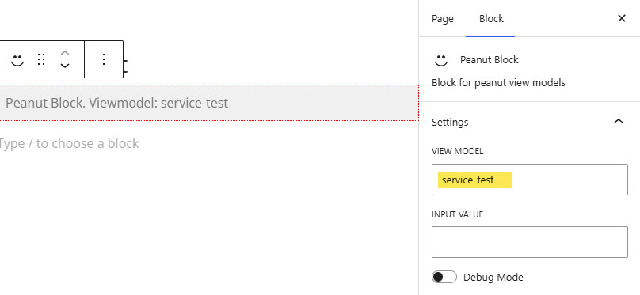

# [Return to docs home page](../../index.md)

# Peanut Gutenberg Block

Gutenberg is WordPress' relatively new (2018) content editing tool.  Like Concrete CMS, the Gutenberg editor
features blocks.  These are components that can be dropped on a page to render various kinds of content.

As we did in ConcreteCMS we have created a way to integrate Peanut view models with WordPress by offering a custom
block "The Peanut Block".  

## Inserting a view model on a WordPress page
First, of course we must create the view model and associated configuration as described in
[View Models and Views](../peanut/viewmodels-views.md)  Or we can find the one we want listed in a viewmodel.ini file (see below). Once we have a view model it can be placed on any page using the Peanut Block. A view model can supply the entire content for a page, 
or it can share the page with other blocks including additional peanut blocks.

When editing a page place a block by pressing '/' or clicking the "+" button. Then select "The Peanut Block" from the list of available blocks.


Once on the page you select it and in the 'Block' panel enter the view model identifier, in the "VIEW MODEL" field in the "Block" tab on the right panel.


There is also the "INPUT VALUE" field.  This is a value that may be used by a Service Command executed by the
viewmodel. See  [Service Commands](../peanut/service-commands.md).  But in most case you will not need to use it. Just
fill in the view model identifier and 'Publish'.

You can find the view model identifier in the viewmodel.ini files, located in these places:
- A viewmodel.ini for application specific features in \tq-peanut\application\config
- One in each package directory in it's own config subdirectory. Examples:
  - /tq-peanut/pnut/packages/peanut-mailings/config/viewmodels.ini
  - /tq-peanut/pnut/packages/peanut-permissions/config/viewmodels.ini

In viewmodel.ini files you can find the view model identifier, enclosed in square brackets at the top of of each section. For example:

```ini
[service-test]
vm=tests/ServiceTest
```

See the Peanut documentation for more information on view models and viewmodel.ini files.
